# **Bayesian Network Agent in Grid World**

## **1. Description of the World**
The world is a **grid-based environment**, similar to Norvig's "Wumpus World." The agent must navigate this world while avoiding pits (`P`) and collecting gold (`G`). The grid contains:
- `0` → Free space
- `B` → Breeze (which indicates a nearby pit)
- `P` → Pit (hazardous location)
- `G` → Gold (goal for the agent)
- `A` → Agent's starting position

This setup aligns with **Norvig's AI principles**, as it represents a **partially observable world** requiring probabilistic reasoning.

---
## **2. Bayesian Network Logic**
The Bayesian Network (BN) models the uncertainty of the world. Each Breeze (`B`) is influenced by adjacent Pit (`P`) cells:

- If `P` is nearby, `B` has a high probability.
- If no `P` is nearby, `B` has a low probability.

---
## **3. Bayesian Network Implementation (`using pgmpy`)**
The BN is implemented in Python using `pgmpy`:

```python
from pgmpy.models import BayesianNetwork
from pgmpy.factors.discrete import TabularCPD

# Define the structure
bn_model = BayesianNetwork([
    ("P1", "B1"), ("P2", "B1"), ("P3", "B1"), ("P4", "B1"),
    ("B1", "A1")
])

# Define CPDs
cpd_p1 = TabularCPD("P1", 2, [[0.8], [0.2]])  # Pit probability
cpd_b1 = TabularCPD("B1", 2, values=[[0.9, 0.5, 0.5, 0.1], [0.1, 0.5, 0.5, 0.9]],
                     evidence=["P1", "P2", "P3", "P4"], evidence_card=[2,2,2,2])

bn_model.add_cpds(cpd_p1, cpd_b1)
```

Inference using `VariableElimination`:

```python
from pgmpy.inference import VariableElimination
inference = VariableElimination(bn_model)
prob_safe_move = inference.query(variables=["A1"], evidence={"B1": 0})
```

---
## **4. Agent's Movement Strategy**

### **Decision-Making Process:**
1. The agent starts at `A` (initial position).
2. It observes its surroundings:
   - If there is **Breeze (`B`)**, avoid risky moves.
   - If **no Breeze (`B=0`)**, adjacent cells are marked safe.
3. Move to the safest adjacent cell (`P=0`).
4. Continue until `G` (Gold) is found.

### **Example Steps in a 4x4 Grid**

| Step | Observation | Action |
|------|------------|--------|
| 1    | No Breeze  | Move forward |
| 2    | Breeze!    | Avoid adjacent pits |
| 3    | Safe path  | Continue moving |
| 4    | Reach Gold | Stop |

---
## **5. Agent Movement Visualization**

The following images depict the agent's movements step by step:
### **An Example (Gold at (1,3))**
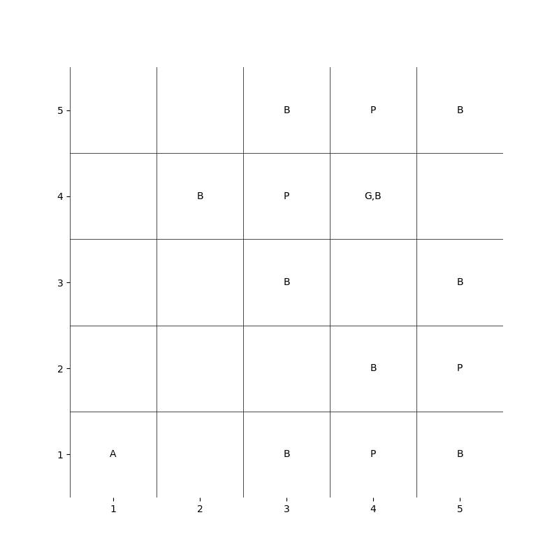

### **Agent's Movements**
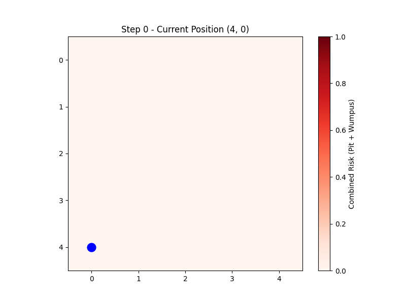  
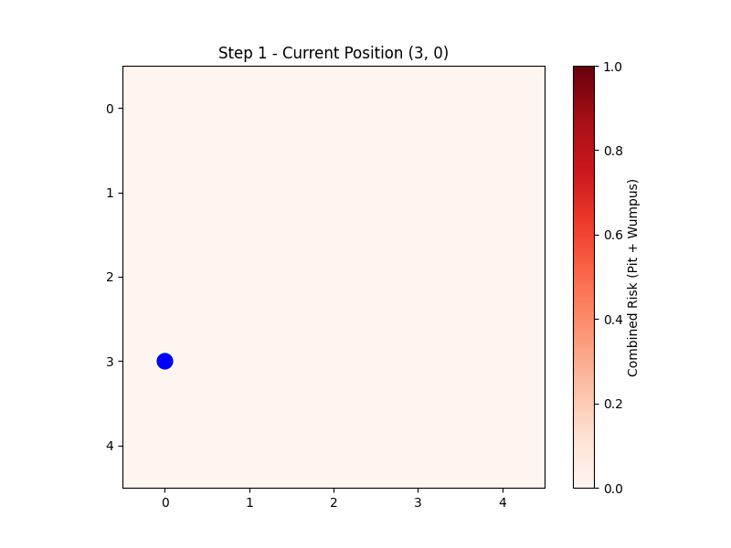  
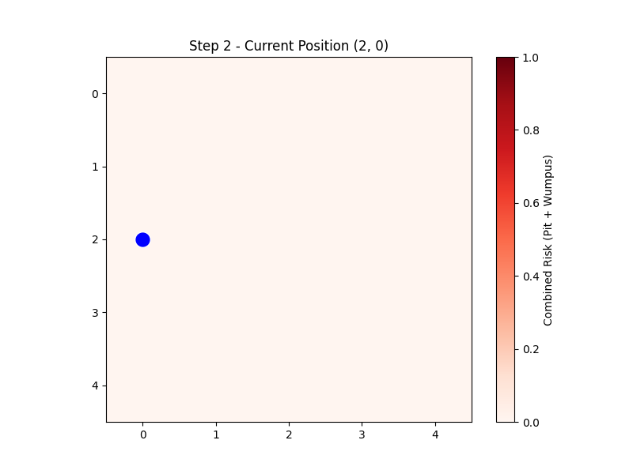  
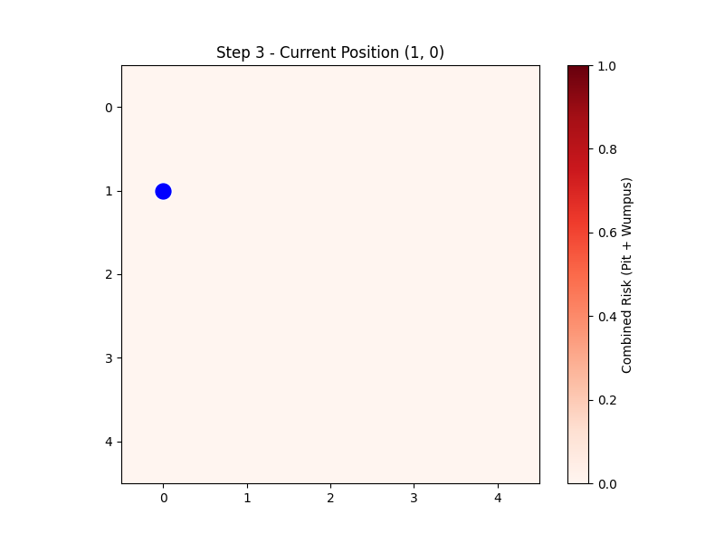  
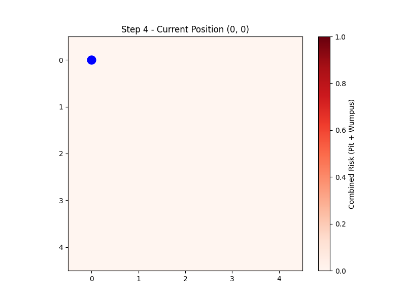  
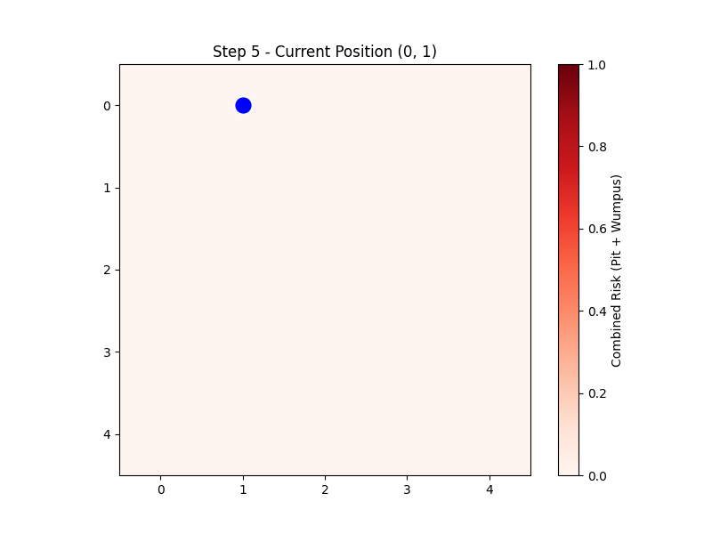  
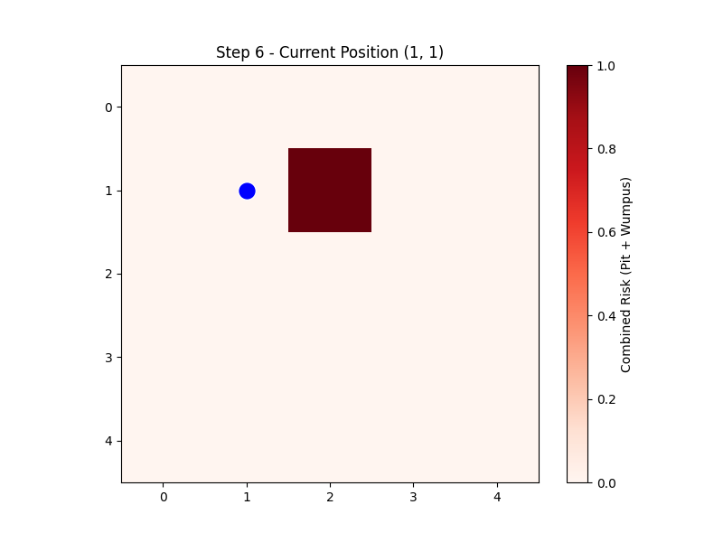  
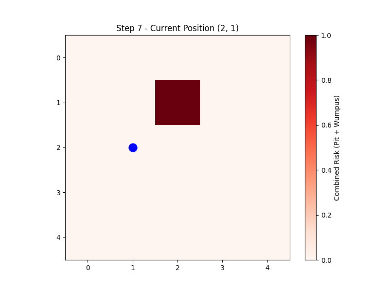  
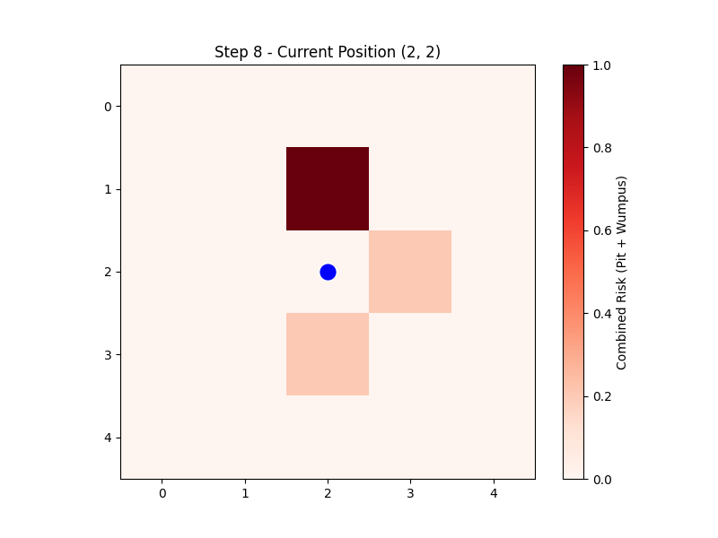  
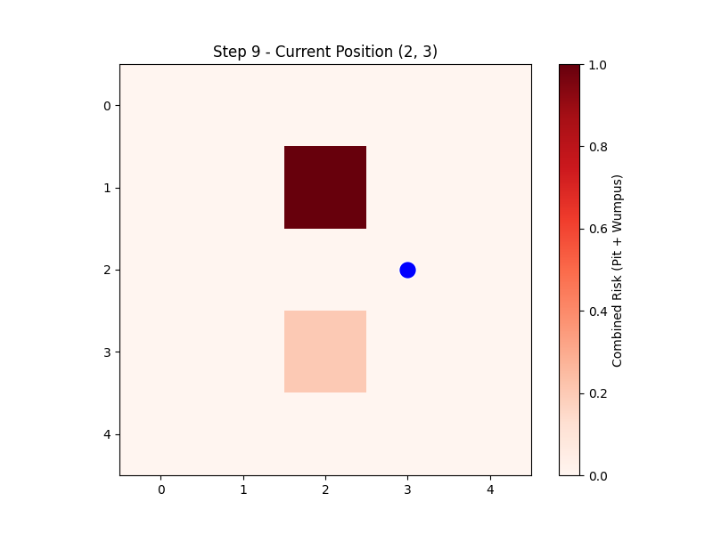  
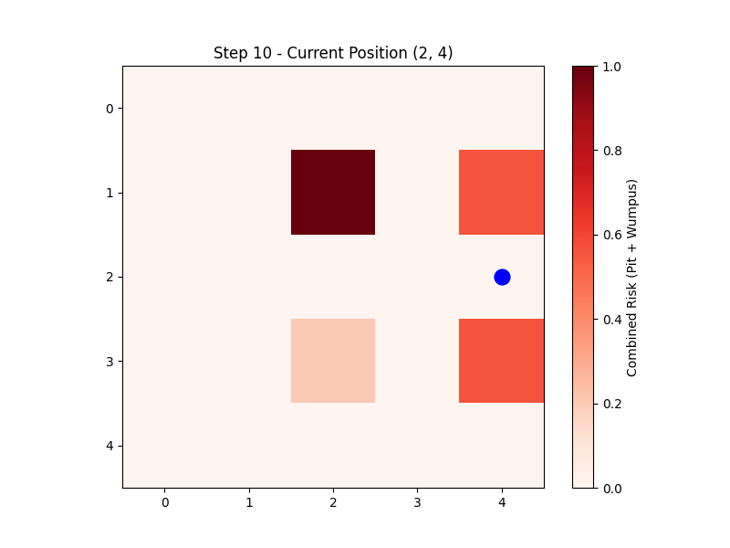  
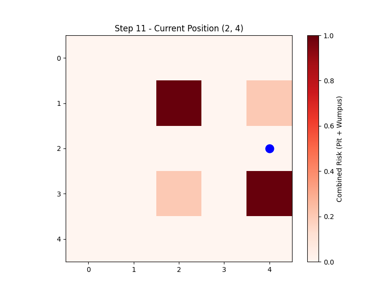  
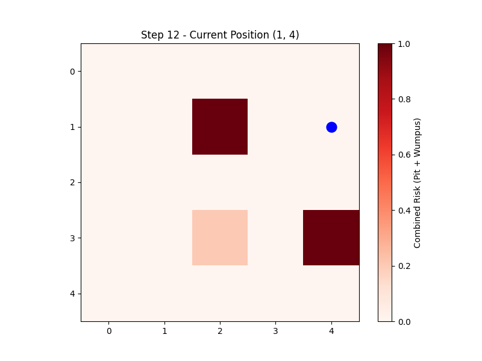  
  
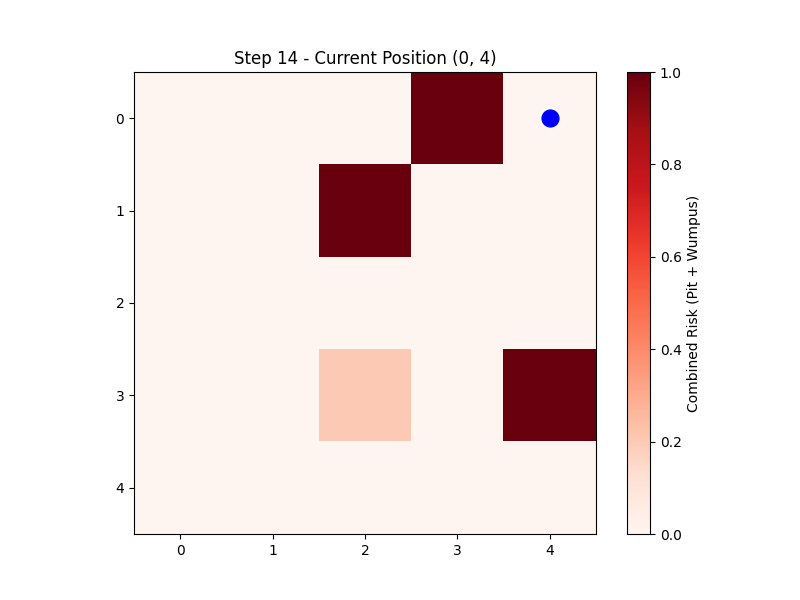  
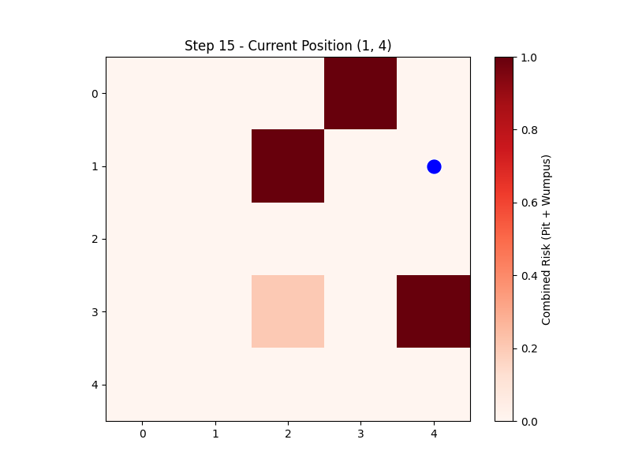  
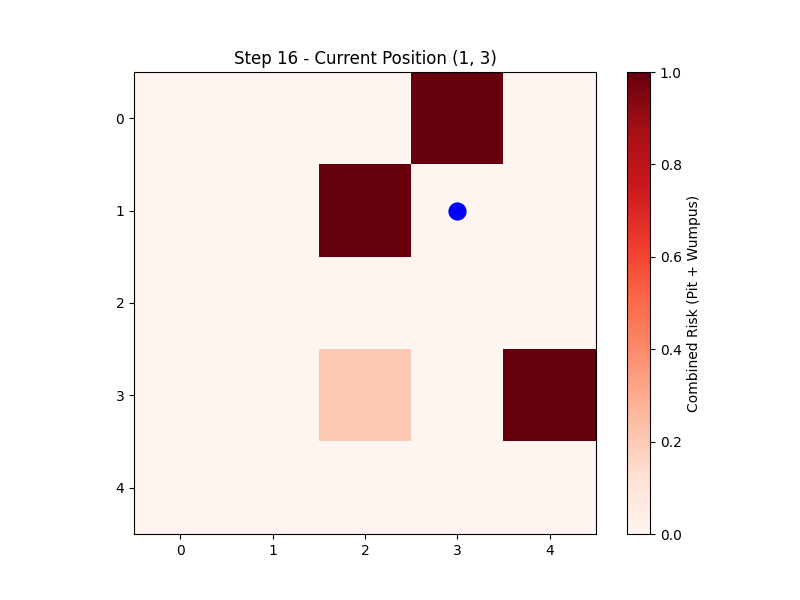  
### **Gold found at (1,3)**

The agent follows a **probabilistic path-finding approach**, balancing **exploration and risk minimization** using Bayesian inference.

---
### **Conclusion**
This Bayesian Network-based agent successfully navigates a grid-world, avoiding pits and reaching its goal by making **rational probabilistic decisions**.

